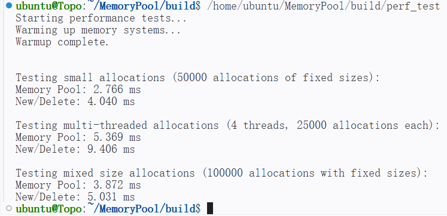

## 一、内存池介绍
基于C++实现的一个线程安全的高并发内存池，旨在优化内存分配和释放的性能，特别是多线程环境下。

## 二、内存池设计
采用ThreadCache、CentralCache和PageCache三层缓存架构设计，通过分层管理提升内存分配效率，减少临界数据来优化多线程访问性能。
1. ThreadCache (线程本地缓存)
  - 每个线程独立的内存缓存
  - 无线程间竞争，快速分配和释放
2. CentralCache (中心缓存)
  - 管理多个线程共享的内存块
  - 通过自旋锁确保线程安全，memory_order来确保线程间数据同步
  - 批量从PageCache获取内存，按需分配给ThreadCache
3. PageCahce (页缓存)
  - 管理以页为单位的内存
  - 向操作系统获取和释放内存

## 三、性能测试
分别对小对象、多线程并发和混合大小内存分配等多种场景下测试，其中大量小对象分配时，内存池与New/Delete相比效率提升30%；多线程下内存池表现最好，效率提升可达40%。系统长时间运行稳定，未出现内存泄露问题。
